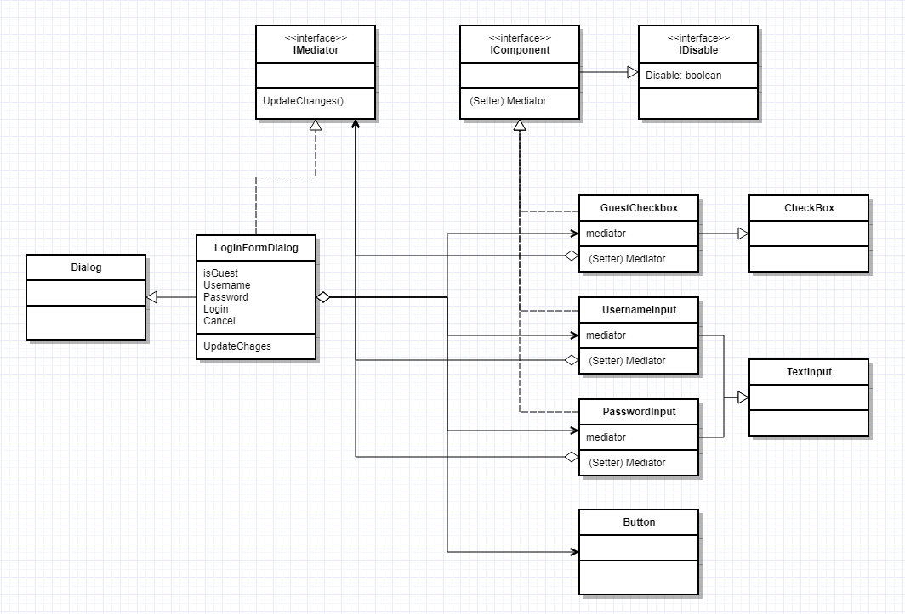

> 여러 객체간의 협업관계를 중앙화하는 패턴

## Context

GUI 개발을 하다 보면 여러 컴포넌트 간의 호출 관계를 그릴 수 있습니다. 우리가 많이
개발하는 UI 중 하나인 로그인 폼을 예로 들어보겠습니다. 사용자의 이름과 암호,
Guest로 로그인, 로그인 버튼, 취소 버튼이 있다고 생각해봅시다. 그럼 대략 아래와
같은 기획과 요구사항이 나올 수 있습니다.


**요구사항**

- Guest로 로그인이 체크된 경우
    - Username과 Password는 비활성화
    - Login 버튼 활성화
- Guest로 로그인이 체크가 되지않은 경우
    - Username은 활성화
    - Password는 Username에 한 글자라도 텍스트가 입력된 경우 활성화
    - Username과 Password 모두 내용이 있는 경우에만 Login버튼 활성화

그리고 개발자는 이 기획대로 컴포넌트 하나 하나 개발해 나가기 시작할 것입니다.

## Problem

`UsernameInput`, `PasswordInput`, `LoginButton`, `GuestCheckbox`, `CancelButton`
그리고 `LoginFormDialog` 클래스 혹은 객체들이 상호 연관관계가 되어 서로 알고 있어야합니다.


위 다이어그램처럼 구현한다면 각 컴포넌트는 경우에는 연관된 모든 컴포넌트에
대해서 필드로 주입받고 그것을 제어하는 형태가 되어야 할 것 입니다. 로직은 여기저기
흩어지게 되며 자칫 어떠한 룰이 변경되면 중복된 로직만큼 수정해야할 수 있습니다.

```csharp
class GuestCheckBox : CheckBox
{
    private readonly Button _login;
    private readonly TextInput _username;
    private readonly TextInput _passwsord;

    public GuestCheckBox(Button login, TextInput username, TextInput passwsord)
    {
        _login = login;
        _username = username;
        _passwsord = passwsord;
    }


    void OnChanged()
    {
        if (Checked)
        {
            _login.Disable(Checked);
            _username.Disable(Checked);
            _passwsord.Disable(!string.IsEmpty(_username.Value) && Checked);
        }
    }
}

class UsernameInput : TextInput
{
    // contructor and fields...

    void OnChanged()
    {
        if (!string.IsEmpty(Value))
        {
            _password.Disable(false);

            if (!string.IsEmpty(_password.Value))
            {
                _loginButton.Disable(false);
            }
        }
    }
}
```

위 코드는 모든 컴포넌트(위젯)에 대해서 표현하진 않았지만 대략적으로 어떠한 코드가
작성될지 예상하실 수 있습니다. 관리적으로도 코드에서 요구사항을 파악할 때에도
분산된 코드에 따른 이유 때문에 아마 후임자가 들어온다면 원 작성자를 원망할지도
모릅니다.


또한 위와같이 `Input`필드가 하나라도 더 추가된다면 4개 혹은 그 이상의 연관 관계가
추가됩니다. 이 같은 방식으로 어플리케이션을 개발하다 보면 굉장히 복잡하게 될
가능성이 높습니다.

## Solution

사실 OOP는 로직이나 책임을 적절히 분해(분산)시키고 이를 조합/협업 관계를 통해
복잡성을 낮춰 높은 재사용/유지보수성을 달성할 수 있는데에 장점이 있습니다.
하지만 하나에서 여러개로 분산시킨다고 해서 항상 복잡성이 비례하여 낮아지는 것은 아닙니다.
재사용성은 해당되는 객체(클래스, 모듈)의 독립성과 비례합니다. 즉 연관관계가 많을
수록 복잡성은 높고 재사용성은 떨어집니다. 위 예제에서는 *각각의 컴포넌트들을 다른
곳에서 재사용할 수 없음을 예상하실 수 있습니다.*

연관관계가 높은 이유에 대해서 생각해봅시다. 이는 각 컴포넌트에서 **요구사항에
따른 관계 컴포넌트를 직접 제어함**에서 발생합니다. 조건에 따른 제어로직을 한
곳으로 모아 관리할 순 없을까요? 그리고 그 역할을 맡을 중개자 컴포넌트는 무엇일까요?

`LoginFormDialog`는 모든 컴포넌트에 접근이 가능하여 중개자 역할로 적합합니다.
따라서 이 컴포넌트에 각각에 흩어져 있던 로직을 `UpdateChanges`로 하나로
응집시켜보도록 하겠습니다.

```csharp
class LoginFormDialog : IDialog
{
    private CheckBox IsGuest { get; }
    private TextInput Username { get; }
    private TextInput Password { get; }
    private Button Login { get; }
    private Button Cancel { get; }

    public LoginFormDialog()
    {
        IsGuest = new GuestCheckBox
        {
            OnClick = () => UpdateChanges;
        };
        // 다른 컴포넌트 생성 로직
    }

    public void UpdateChanges()
    {
        Username.Disable = !IsGuest.Checked;
        Password.Disable = !IsGuest.Checked && !string.IsNullOrEmpty(Username.Value);
        Login.Disable = !string.IsNullOrEmpty(Username.Value) && !string.IsNullOrEmpty(Password.Value);
    }
}
```

많은 연관관계가 있던 전에 비해 깔끔해졌습니다. 하지만 각 컴포넌트에서 어떤 이벤트일
때에 `UpdateChanges`가 호출될 것인가에 대해서는 해당 컴포넌트에서 결정되어야 합니다.
따라서 각 컴포넌트는 `LoginFormDialog`에 대해서 알고 있으며 적절한 이벤트에
`UpdateChanges`를 호출해줘야 합니다.

```csharp
{
interface IComponent : IDisable
{
    LoginFormDialog Dialog { get; set; }
}

class UsernameInput : TextInput, IComponent
{
    public LoginFormDialog Dialog { get; set; }

    public UsernameInput()
    {
        OnChange += () => Dialog?.UpdateChanges();
    }
}
```

더불어 `LoginInput`이나 `PasswordInput`은 서비스에서 정한 규칙에 따른 검증 로직을
가지고 있고 이는 `Dialog` 뿐만 아니라 `MainView`, `OAuthPopup`등에서도 쓰일 수
있으므로 중개자 그 자체를 인터페이스로 변환해 느슨(Loose Couple)하게 만들어 줍시다.

```csharp
interface IMediator
{
    void UpdateChanges();
}

class UsernameInput : TextInput, IComponent
{
    public IMediator Mediator { get; set; }

    public UsernameInput()
    {
        OnChange += () => Mediator?.UpdateChanges();
    }
}
```

위와 같은 과정을 거치면 최종적으로 아래와 같은 다이어그램이 만들어집니다.



## Summery

한 집합에 속해있는 객체의 상호작용을 캡슐화하는 객체를 정의합니다. 객체들이
직접 서로를 참조하지 않도록 하여 객체 사이의 느슨한 결합(loose coupling)을
촉진시키며, 개발자가 객체의 상호작용을 독립적으로 다양화시킬 수 있게 만듭니다.

### 참여자


- 중개자(Mediator) : 객체와 교류하는 데 필요한 인터페이스
- 구체 중개자(Concrete Mediator) : 객체간 조화를 이뤄서 협력하는 행동을 구현하며, 자신이 맡을 동료를 파악하고 있다.
- 동료(Colleague) : Mediator와 통신을 실행할 인터페이스, 통신의 규약(API)를 결정한다.
- 구체 동료(Concrete Colleague) : 다른 객체와 통신을 하는 대상, 중개자를 알고 있으며 통신은 중개자를 통해 진행한다.

### 결과

- sub-classing이 제한됩니다. `LoginFormDiagram`은 결과적으로 각각의 컴포넌트 클래스들이 통신하기 위한 클래스이므로 재사용이 어렵습니다. 굳이 재사용하겠다면 이를 상속받은 후 기능을 오버라이딩 시켜서 사용할 수 있습니다.
- Colleague 객체간의 종속성을 줄입니다. 기존에는 연관관계 컴포넌트를 모두 알아야 했다면 패턴이 적용된 이후에는 Mediator 만 바라보면 됩니다. 또한 이를 재사용하기도 쉬워집니다.
- 객체 프로토콜이 단순화됩니다.
- 협력 방법을 추상화합니다.
- 통제가 집중화됩니다. 복잡한 모든 것이 하나로 합쳐져 좀 더 직관적이고 빠르게 파악할 수 있게 되었습니다.

### Q&A

#### `Coleague`가 `IComponent`로 인터페이스인 이유는 무엇인가요?

첫 번째로 C#은 다중 상속을 허용하지 않습니다. 보통 GUI 프로그래밍에서는 프레임워크에서
제공하는 기본 클래스들이 있으며 이를 상속하는 형태로 재사용 컴포넌트를 만듭니다.
`Password`인풋의 경우 다양한 곳에서 쓰기 때문에 서비스의 암호 유효성 검증 로직은
이곳에 있어야합니다. 만약 Abstract Class로 동료(Colleague) 클래스를 제공하고 싶다면
아래와 같은 다이어그램과 같이 해결할 수 있습니다. 하지만 작업 비용 대비 큰 이득이 없으며
오히려 복잡성만 증가시키고 있습니다. 특히 `Component`클래스의 종류가 많은 경우
의미 없는 추상 클래스의 개수가 늘어나므로 추천하는 방법은 아닙니다.


두 번째로 `Property`로 어느 정도 속성 명시를 명확하게 할 수 있습니다. 물론 정확한
속성을 의미하지 않습니다만, 상속 후 기본 구현만으로도 Auto Generated Field가
생성되므로 코드 양이 많이 늘어나지 않습니다.

#### `IComponent`에서 통신을 위한 API 정의는 어떤 것인가요?

별도 메서드로 뺄 수 있지만 기본적으로 비활성화(Disable) 기능 기본으로 제공되는
컴포넌트(위젯) 클래스들이 구현하고 있는 경우가 많기 때문에 `IDisable` 인터페이스
그 자체를 `Mediator`와 통신을 위한 API로 사용하기 때문에 달리 추가적으로 정의할
필요는 없었습니다.

#### 중개자 인터페이스는 필수인가요?

아닙니다. 중개자는 보통 재사용기 불가능하거나 어렵기 때문에 중개자가 아닌 구체
클래스를 동료 클래스에 제공하셔도 됩니다. 하지만 보통 중개자 클래스는 순수하지 않고
외부와의 통신 등의 테스트하기 어렵게 하는 로직이 있기 때문에 인터페이스를 만드셔서
가짜 객체를 제공할 때에는 편하실 수 있습니다.

### C#에서의 적용

개발자는 대부분의 케이스에서 중개자 개념을 적용하고 있습니다. 전혀 대단한 패턴이
아닙니다. 또한 위 GoF 다이어그램에서 `createComponent`는 사실 생성자로 합쳐질
수 있습니다. 자바와는 다르게 `Intializer`와 `event`, 람다 익스프레션으로 충분히
코드를 짧게 작성할 수 있기 때문에 흐름에 영향을 주지 않습니다. 또한 인터페이스로
정의하게되면 `private`키워드로 구현할 수 없기 때문에 동료 클래스의 생성 로직을
외부에 노출시키게 됩니다. 그리고 컴포넌트(동료)가 재사용되지 않는다고 가정하면
중개자에게 어떠한 이벤트에서 `UpdateChanges`를 실행할지에 대해 위임시켜도 나쁘지
않습니다.