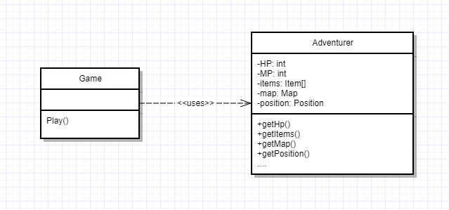
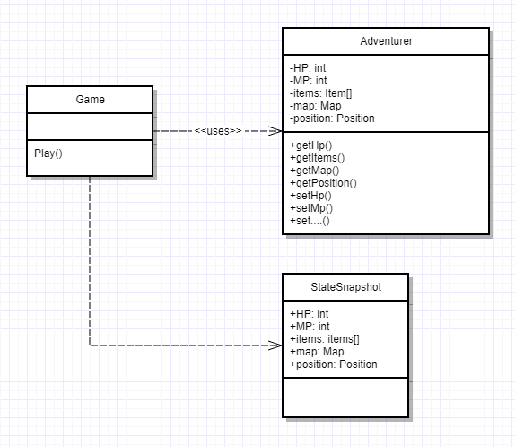
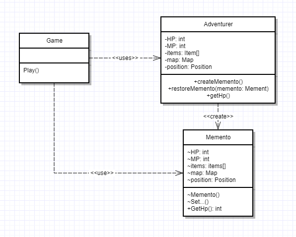

# Memento Pattern


> 캡슐화를 위배하지 않은 채 내부 상태의 스냅샷을 찍는 패턴

## Context

어떤 스토리가 있는 RPG게임을 생각해봅시다. 사용자는 모험가를 통해 게임을 플레이할
것이며 각 단계의 스테이지를 깨나가면서 캐릭터는 성장하게 될 것입니다. 몬스터들을
처치하면서 아이템도 오를 것이고 HP와 MP도 사용할 것입니다. 그리고 모험가는 맵을
모험하면서 위치도 계속해서 변경되겠죠. 아마 예상을 하자면 아래와 같은 다이어그램이
나오지 않을까 싶습니다.



## Problem

하지만 유저는 항상 모든 맵을 처음 모험하다보니 더 어려운 상대를 만나서 다치기도
하고 죽기도할 것입니다. 하지만 RPG게임이 실제 인생과 같이 모든 것을 잃고 다시
시작한다면 게임플레이어는 아마 이 게임에 대해서 욕을 할지도 모릅니다.

그래서 개발자는 아래와 같이 세이브 포인트를 만들기 시작합니다.

우선 `Game`클래스에서 세이브 포인트 처리를 위해서 `Adventurer`클래스의 필드에
대한 초기화 프로퍼티들이 공개되어야 합니다. CSharp은 Property 선언시 컴파일
타임에 자동적으로 필드가 생성되므로 코드를 많이 절약할 수 있습니다.

```csharp
class Adventurer
{
    // Auto generated fields
    public int Hp { get; set; }
    public int Mp { get; set; }
    public Position Position { get; set; }
    public Map CurrentMap { get; set; }
    public IEnumerable<Item> Items { get; set; }
}
```

또한 이런 `Adventurer`자체를 클론하여 저장할 수 없으니 상태 필드에 대해
추상화하여 `StateSnapshot` 클래스를 만들어서 별도로 저장하기 시작합니다.

```csharp
struct StateSnapshot
{
    public int Hp { get; set; }
    public int Mp { get; set; }
    public Position Position { get; set; }
    public Map CurrentMap { get; set; }
    public IEnumerable<Item> Items { get; set; }
}
```
`Game` 클래스는 이러한 `StateSnapshot`을 몇 개까지 어떻게 저장할지를 관리합니다.

```csharp
public class Game
{
    private readonly IList<StateSnapshot> _snapshots = new List<StateSnapshot>();

    public void Play()
    {
        var adventurer = new Adventurer();

        while (true)
        {
            if (adventurer.Position.IsSavePoint)
            {
                _snapshots.Add(new StateSnapshot
                {
                    CurrentMap = adventurer.CurrentMap,
                    Hp = adventurer.Hp,
                    Mp = adventurer.Mp,
                    Items = new List<Item>(adventurer.Items),
                    Position = adventurer.Position
                });
            }

            // Try adventure

            if (adventurer.Hp <= 0)
            {
                var lastSnapshot = _snapshots.Last();
                adventurer.Hp = lastSnapshot.Hp;
                adventurer.Mp = lastSnapshot.Mp;
                adventurer.Items = lastSnapshot.Items;
                adventurer.Position = lastSnapshot.Position;
                adventurer.CurrentMap = lastSnapshot.CurrentMap;
            }
        }
    }
}
```

위 코드는 아마 아래와 같은 다이어그램이 그려질 것입니다.



하지만 무언가 찜찜합니다. 모험가의 상태가 `public`하게 공개되어있는게 과연 좋은
설계일지 생각해봐야할 것입니다. 객체의 인스턴스 필드가 `public`이라고 함은
사실 전역변수와 별로 다를 바가 없습니다. 객체가 어떻게 어디에서 수정할지 아무도
모르기 때문이죠. 퀘스트가 추가되고 PvP 배틀, 시나리오, 파티 등등이 되면 모험가는
아주 많은 클래스와 코드와의 협업관계를 가지게 되는데 모든 곳에서 모험가의 상태를
수정할 수 있게 된다면 관리 차원에서 힘들어지게 될 것입니다. 이것은 **캡슐화의
파괴**입니다. 또 다른 말로는 **추잡한 노출(Indecent Exposure)** 코드 스멜로
분류됩니다.

## Solution

우선 캡슐화가 왜 깨지는지에 대해서 곰곰히 생각해볼 필요가 있어보입니다. 아마
직접적인 원인은 `Game`클래스에서 `Adventurer`클래스의 상태필드에 직접 접근하여
상태를 설정하거나 가져오기 때문일 것입니다. 하지만 스냅샷을 사용하거나 이를
이용하려면 반드시 그 정보가 필요합니다. 따라서 스냅샷을 **생성**/**이용**에 대한
내용을 `Adbenturer`클래스로 옮기면 될 것 같습니다.

```csharp
class Adventurer
{
    // State...

    public StateSnapshot CreateSnapshot()
    {
        return new StateSnapshot
        {
            CurrentMap = CurrentMap,
            Hp = Hp,
            Mp = Mp,
            Items = new List<Item>(Items),
            Position = Position
        };
    }

    public void RestoreSnapshot(StateSnapshot snapshot)
    {
        Hp = snapshot.Hp;
        Mp = snapshot.Mp;
        Items = snapshot.Items;
        Position = snapshot.Position;
        CurrentMap = snapshot.CurrentMap;
    }
}
```

그리고 `Game`클래스를 수정합니다.

```csharp
public class Game
{
    private readonly IList<StateSnapshot> _snapshots = new List<StateSnapshot>();

    public void Play()
    {
        var adventurer = new Adventurer();

        while (true)
        {
            if (adventurer.Position.IsSavePoint)
            {
                _snapshots.Add(adventurer.CreateSnapshot());
            }

            // Try adventure

            if (adventurer.Hp <= 0)
            {
                adventurer.RestoreSnapshot(_snapshots.Last());
            }
        }
    }
}
```

이렇게 수정하고나니 더이상 모든 상태필드가 `public`일 필요가 사라졌습니다. 따라서
각 필드별로 적절하게 접근자를 수정해주도록 합시다.

```csharp
class Adventurer
{
    public int Hp { get; private set; }
    private int Mp { get; set; }
    public Position Position { get; private set; }
    private Map CurrentMap { get; set; }
    private IEnumerable<Item> Items { get; set; }

    // Methods
}
```

또한 `StateSnapshot`또란 수정해주도록 합시다. 코드는 굳이 작성하지 않겠습니다.
C#는 자바와 다르게 `internal`키워드가 어셈블리 단위라 네임스페이스(package)에
대응되는 접근자가 존재하지 않습니다. 이런 도메인 클래스는 별도 프로젝트로 빼서
경계를 확실하게 하는 편이 좋을 것 같습니다.

사실 `StateSnapshot`클래스에는 두가지 API가 존재합니다.

- wide interface : 원본 오브젝트 상태를 원래 상태로 되돌리기 위한 API
- narrow interface : Caretaker, 즉 스냅샷을 관리하는 역할자에게 보여주는 API

wide는 대부분의 narrow은 원본 오브젝트의 복구 기준 값이 되는 데이터를 공개합니다.
그래서 캡슐화가 깨지는 것을 막고 적절한 수준으로 관리되도록 할 수 있습니다.

위 예제에서는 만약 `StateSnapshot`이 Database에 저장되는 경우 기준 값으로 아마
`Postion`과 `Map`을 이용하여 가장 가까운 세이브 포인트로 가져올 수 있도록 할 수
있습니다.

```csharp
struct StateSnapshot
{
    internal int Hp { get; set; }                   // wide
    internal int Mp { get; set; }                   // wide
    public Position Position { get; set; }          // narrow
    public Map CurrentMap { get; set; }             // narrow
    internal IEnumerable<Item> Items { get; set; }  // wide
}
```

아마 이런식으로 구성이 될 가능성이 높습니다.



자바에 비해 넓은 수준의 접근자를 가진 C#이 조금 아쉽긴 하지만 어느정도
감안하더라도 캡슐화의 부재가 없는 것보단 있는 편이 관리적 차원에서 훨씬 이득일 것
입니다.


## Summery

### 역할자

- Originator(작성자) : 원본 객체, 스냅샷을 생성하고 사용함
- Memento(기념품) : 스냅샷
    - wide interface : 스냅샷을 이용해 상태를 원본으로 되돌리기 위한 API 셋
    - narrow interface : 외부에 공개하기 위한 보통 스냅샷 관리의 기준 값이 되는 API
- Caretaker(관리인) : 스냅샷을 찍고 관리, narrow interface만 사용 가능


### 주의할 점

- C#은 같은 프로젝트 내에서 namespace로 메멘토 패턴의 순수 구현은 불가능합니다.
- 메멘토 관리 비용
  스냅샷 생성 기준에 따라 저장하고 관리하는 비용이 생각보다 적지 않을 수 있습니다.
  또한 메멘토를 물리적으로 저장하고 관리할 때 시간에 따른 버전 차이가 발생할 수 있습니다.
  이를 대비하기 위해서 마이그레이션 정책을 가지고 있는 편이 좋습니다.
- 메멘토 사용 비용
  메멘토를 상태를 보호하거나 복구하는 비용이 싸지 않으면 패턴은 적합하지 않습니다.
  차라리 변경 내용에 대해서 저장하는 편이 저렴하다면 그 방향을 선택하는 것이 나을 수 있습니다.
  이를 _점증적 상태 변경 저장_ 이라고 합니다.
- 캡슐화된 경계를 유지할 수 있습니다.
