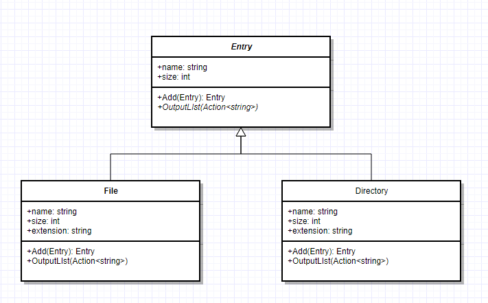
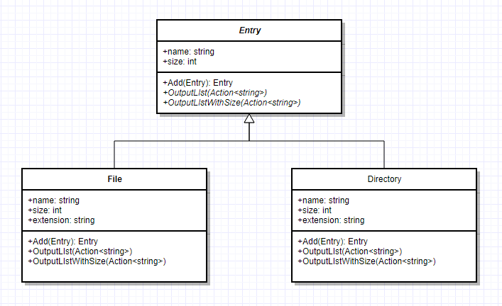
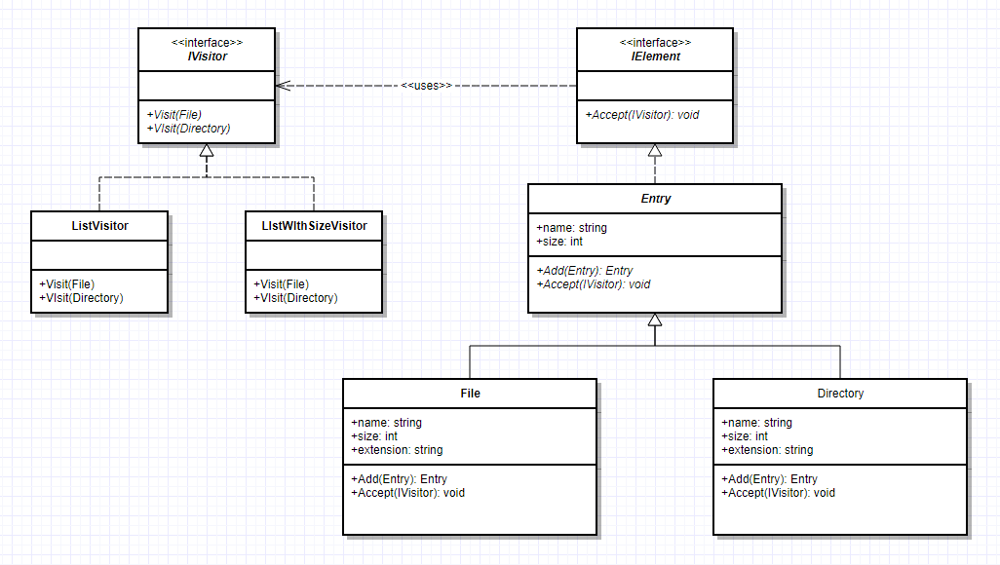

# Visitor Pattern


> 방문자 패턴은 데이터 구조와 처리를 분리하는 패턴입니다.

## Context

우선 방문자 패턴이 무엇인지 보다는 어떤 때에 사용하는 것이 좋은지에 대해서 알아봅시다.
흔히 접할 수 있는 구문트리, 아래와 같은 파일시스템, 혹은 계층적 구조로 형성되는
데이터를 처리 할때에는 각각의 노드 클래스에 처리와 관련된 로직을 구현하는 것이 일반적인 방법입니다.



위 이미지는 `File`과 `Directory`클래스로 파일 시스템을 표현한 다이어그램입니다.
메서드로는 `OutputList`라는 재귀적으로 파일 리스트를 출력하는 로직을 가지고 있습니다.
이를 호출하게 되면 리눅스의 `ls -R`처럼 하위에 있는 모든 파일 리스트를 출력하게 됩니다.

```csharp
public abstract class Entry
{
    public string Name { get; set; }
    public int Size { get; set; }

    public Entry Add(Entry entry)
    {
        throw new Exception("FileTreatmentException");
    }

    public abstract void OutputList(Action<string> output);
}

public class File : Entry
{
    public string Extension { get; set; }

    public File(string name, string extension)
    {
        Name = name;
        Extension = extension;
    }

    public override void OutputList(Action<string> output)
    {
        output("/" + Name + "." + Extension);
    }
}

public class Directory : Entry
{
    private readonly List<Entry> _entries = new List<Entry>();
    public IEnumerable<Entry> Entries => _entries;

    public Entry Add(Entry entry)
    {
        _entries.Add(entry);
        return entry;
    }

    public override void OutputList(Action<string> output)
    {
        var path = "/" + Name;
        output(path);

        foreach (var entry in Entries)
        {
            entry.OutputList(name => output(path + name));
        }
    }
}
```

이를 활용한 코드는 아래와 같은 출력 결과를 얻으실 수 있습니다.

```
/dir
/dir/file1
/dir/file2
```

이때까지는 별 문제가 없어보입니다.

## Problem

하지만 현재 코드로는 리스트 출력시 확장자를 얻을 수 있는 방법이 없습니다.
확장자 또한 포함하여 출력하는 로직을 추가해보도록 해봅시다.



아마 상위 추상 클래스에 추상 메서드를 추가하고 구현 클래스에서 각각의 메서드를 구현해주면
해결되어 보입니다. 이러한 요구 사항으로 인해 노드가 많아질수록 혹은 각각의 노드를 처리하는
로직이 많아질수록 코드를 분석할 때에 여기저기 퍼저있는 로직들을 보면서 분석해야 합니다.

사실은 서로 관련 있는 로직들이 응집되어있지 않아서 디버깅 혹은 분석하기에 어려움이 증가하며
만약 일부 처리하는 과정 속에 공통된 작업이 있다면 해당 공통된 작업들은 자칫 모든 노드에 같은 로직이
퍼져 있어 변경 시에는 산탄총 수술로 이어질 수 있게 됩니다.

## Solution

위의 문제를 해결하려면 처리하는 프로세스 관점에서 응집시키고 이를 각 노드들이 활용하도록
만드는 방향은 어떨까요?



`Entry` 추상 클래스는 `IVisitor`를 받아들이는(`Accept`) `IElement` 인터페이스를 구현하고
각각의 구상 클래스에 대한 처리를 `IVisitor`의 메서드로 정의할 수 있을 것입니다.

```csharp
public interface IElement
{
    void Accept(IVisitor visitor);
}

public interface IVisitor
{
    void Visit(File file);
    void Visit(Directory file);
}

public class ListVisitor : IVisitor
{
    public ListVisitor(Action<string> output)
    {
        Output = output;
    }

    private Action<string> Output { get; set; }
    private string CurrentDir { get; set; }

    public void Visit(File file)
    {
        Output(GetPath(file));
    }

    public void Visit(Directory file)
    {
        var temp = CurrentDir;
        var currentDir = GetPath(file);
        Output(currentDir);
        CurrentDir = currentDir;

        foreach (var entry in file.Entries)
        {
            entry.Accept(this);
        }

        CurrentDir = temp;
    }

    private string GetPath(Entry file)
    {
        return CurrentDir + "/" + file.Name;
    }
}
```
처리하는 로직이 응집되었고 `GetPath`라는 공용 가능한 로직도 별도로 추출되어 사용되고 있습니다.
`ListOutput`이 아닌 별도 시스템에 전달하는 비동기 메서드가 있을 수 있거나 파일 트리를 순회하면서
특정 위치로 파일들을 이동시키거나 복사할 때에 코드의 응집도가 높아 재사용성이 늘어나며 노드 클래스들을
수정하지 않고 **처리에 대한 확장**이 가능해져 OCP 원칙을 준수하게 됩니다. 특히나 각 노드에서 Directory Path를
연산한다던가 WebRequest를 보내는 것은 실제 데이터를 구조화하는 노드의 역할이 아닙니다.

### 참여자

- Visitor : 방문자, 실제 ConcreteElement 들에 대한 처리에 관해 기술합니다. 실제 처리로직을 포함되어있지 않습니다.
- ConcreteVisitor : Visitor의 구현으로 각 ConcreteElement에 대한 처리 로직을 구현합니다. 알고리즘이 운영될 수 있는 상황정보를 제공하며 자체 상태를 저장합니다.
  구조를 순회하며 누적되는 경우가 많습니다.
- Element(Node) : 방문자를 인자로 받아들이는 `Accept` 연산을 정의합니다.
- ConcreteElement : `Accept`에 대해 구현하며 객체의 연산 노드를 담당합니다.
- ObjectStructure : 객체 구조 내의 원소들을 나열할 수 있습니다. Composite 패턴으로 만든 복찹체일 수도 있고, List나 Set등의 컬렉션일 수 있습니다.

### 결과

1. 연산에 대한 확장이 쉬워집니다. `IVisitor`의 구현 클래스로 하나만 추가하면 전체 데이터 구조에 대한 연산이 추가된겁니다.
2. 연산은 한 군데로 모으고 관련되지 데이터 구조에서 연산을 때어낼 수 있습니다.
3. 새로운 ConcreteElement 추가는 어렵습니다. 새로운 데이터 노드가 추가될 때마다 모든 방문자에 이에 대응하는 로직을 구현해야합니다.
4. 계층구조로 방문하게 됩니다.
5. 상태를 누적할 수 있습니다. 연산이 분산되어 있지 않아서 하나의 상태를 변경하면서 모든 노드를 방문할 수 있습니다. 보통은 노드를 방문할 때마다 데이터가 누적됩니다.
  만약 로직이 분산되어있었다면 전역변수를 이용하던 연산에 의해 전달되던 깔끔하지 못하게 공유될 것입니다.
6. 데이터의 은닉을 깰 수 있습니다. 내부 상태에 접근하는 내용들에 대해서 모두 공개 인터페이스로 만들 수 밖에 없어서 외부에 데이터가 노출하게 됩니다.


### 이중 디스패치(Double Dispatch)

결론적으로 Visitor Pattern은 Double Dispatch가 핵심입니다. 이는 클래스를 변경하지 않으면서 해당 클래스에 메서드를
추가하는 패턴입니다. 위 예제에서는 `element.Accept(visitor)`를 통해 내부에서 `visitor.visit(this)`를 하게되므로
이를 Double Dispatch라고 부르며 실제로 `Accept` 메서드는 `visitor`에게 함수 실행 로직을 위임함으로써 실제로 기존 코드를
변경 없이 `Accept`에 대한 구현을 동적으로 변화시킬 수 있습니다. 언어적으로 다중 디스패치를 지원한다면 Visitor 패턴은
필요하지 않을 수 있습니다.
